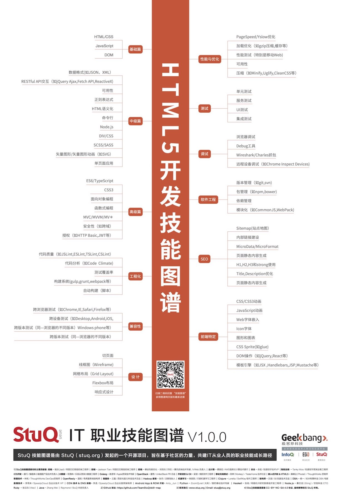

序
===

为什么不应该写一本前端书籍？
---

2016 年的时候，我作为一个技术审阅，参与了三本英语版的 Angular 2 书籍的编写。

年初的时候，我已经陆续收到了《Angular Service》 以及 《Getting started with Angular - 2nd Edition》 两本书，但是还有一本书还没有出版，这是一个**发人深省**的故事。

2015 年底，Angular 团队发布了 Angualr 2 的 Beta 版。在经历了半年的稳定更新后，大部分的开发者以为 Angular 已经接近稳定了。有一些便（如我 @phodal）开发了相应的 Angular  2 应用，同时，有一些技术作者撰写相应的书籍。即，上面说到的那本书的作者，便是其中的一员。作者在写作时，预计了一下进度，估计出版的时间是 2016 年底。

后来，Angular 2 Beta RC 5 更新了大量的 API，导致开发者几乎要重写应用。也因此需要结合 Angular 2 的正式版，来更新相应的代码，便需要做大量的工作来更新内容。

出版时间，因此改到了 2017 年四月份。可是到了 2017 年四月份的时候，Angular 4 已经推出正式版了。后来，这本书的出版日期便推到了今年的七月份。

谁知道到了 2017 年的七月份又会怎样？？

这就有些尴尬了。

三个月后的前端，又会怎样呢？

我也不知道。

本书在讲些什么
---

首先，让我们来理解一个概念：什么是前端？

> 与客户做交互的那部分就是前端，也因此，它可以称为客户端。

而前端不仅仅局限于浏览器前的用户，还可以是桌面应用，混合应用。也因此，你会发现前端是一个特别大的领域。一个优秀的前端程序员，要掌握相当多的技能，如下图所示：

这些技能便是：

#### 入门

在我理解下的基础知识，就是我们可以写一些基本的样式，并能对页面的元素进行操作。举例来说，就是我们用Spring和JSP写了一个博客，然后我们可以用jQuery来对页面进行一些简单的操作，并可以调用一些API。因此，我们需要基本的HTML / CSS知识。只是要写好CSS并不是一件简单的事，这需要很多实战经验。随后，我们还需要有JavaScript的经验，要不怎么做前端呢？

同时，我们还需要对DOM有一些基础的了解，才能做一些基本的操作，如修改颜色等等。在这种情况下，最简单的方案就是使用jQuery这样的工具。不过，如果可以自己操作DOM是再好不过的了。

#### 中级篇 

中级篇就更有意思了，现在我们就需要对页面进行更复杂的操作。Ajax和JSON这两个技能是必须的，当我们要动态的改变页面的元素时，我们就需要从远程获取最新的数据结果。并且我们也需要提交表单到服务器，RESTful就是必须要学会的技能。未来我们还需要Fetch API，ReactiveX这些技能。

除此我们还需要掌握好HTML的语义化，像DIV / CSS这也会必须会的技能，我们应该还会使用模板引擎和SCSS / SASS。而这个层面来说，我们开始使用Node.js来完成前端的构建等等的一系列动作，这时候必须学会使用命令行这类工具。并且，在这时候我们已经开始构建单页面应用了。

#### 高级篇

JavaScript是一门易上手的语言，也充满了相当多的糟粕的用法。几年前人们使用CoffeeScript编成成JavaScript来编写更好的前端代码，现在人们有了ES6、TypeScript和WebPack来做这些事。尽管现在浏览器支持不完善，但是他们是未来。同样的还有某些CSS3的特性，其对于某些浏览器来说也是不支持的。而这些都是基于语言本身来说的，要写好代码，我们还需要掌握面向对象编程、函数式编程、MVC / MVVM / MV*这些概念。作为一合格的工程师，我们还需要把握好安全性（如跨域），做好 授权（如HTTP Basic、JWT等等）。

#### 工程化

这个标题好像是放错了，这部分的内容主要都是自动构建的内容。首先，我们需要有基本的构建工具，无论你是使用gulp、grunt，还是只使用npm，这都不重要。重要的是，你可以自动化的完成构建的工具，编译、静态代码分析（JSLint、CSS Lint、TSLint）、对代码质量进行分析（如Code Climate，可以帮你检测出代码中的Bad Smell）、运行代码中的测试，并生成测试覆盖率的报告等等。这一切都需要你有一个自动构建的工作流。

#### 兼容性

虽然我们离兼容IE6的时代已越来越远了，但是我们仍然有相当多的兼容性工作要做。基本的兼容性测试就是跨浏览器的测试，即Chrome，IE，Firefox，Safari等等。除此还有在不同的操作系统上对同一浏览器的测试，某些情况下可能表现不一致。如不同操作系统的字体大小，可能会导致一些细微的问题。而随着移动设备的流行，我们还需要考虑下不同Android版本下的浏览器内核的表现不致，有时候还要考虑一下不成器的Windows Phone。除此，还有同一个浏览器的不同版本问题，常见于IE。。

#### 前端特定

除了正常的编码之外，前端还有一些比较有意思的东西，如CSS3和JavaScript动画。使用Web字体，可惜这个不太适合汉字使用。还有Icon字体，毕竟这种字体是矢量的。不过Icon字体还有一些问题，如浏览器对其的抗锯齿优化，还有一个痛是你得准备四种不同类型的字体文件。因此，产生了一种东西SVG Sprite，在以前这就是CSS Sprite，只是CSS Sprite不能缩放。最后，我们还需要掌握一些基本的图形和图表框架的使用。

#### 软件工程

这一点上和大部分语言的项目一样，我们需要使用版本管理软件，如git、svn，又或者是一些内部的工具。总之你肯定要有一个，而不是 2016.07.31.zip这种文件。然后，你还需要一些依赖管理工具，对于那些使用Webpack、Browserify来将代码编写成前端代码的项目来说，npm还是挺好用的。不过就个人来说，对于传统的项目来说我总觉得bower有些难用。我们还需要模块化我们的源码文件，才能使其他人更容易开始项目。

#### 调试
 
作为一个工程师来说，调试是必备的技能。大部分浏览器都自带有调试工具，他们都不错——如果你使用过的话。在调试的过程中，直接用Console就可以输出值、计算值等等。如果你的项目在构建的过程中有一些问题，你就需要debugger这一行代码了。在一些调用远程API的项目里，我们还需要一些更复杂的工具，即抓包工具。在调试移动设备时，像Wireshark、Charles这一类的工具，就可以让我们看到是否有一些异常的请求。当然在这个时候，还有一个不错的工具就是像Chrome自带的远程设备调试。对于移动网站来说，还要有Responsive视图。
 
#### 测试

我遇到的很多前端工程师都是不写测试的，于是我便把它单独地抽了出来。对于一个前端项目来说，正常情况下，我们要有单元测试、功能测试，还有要一些UI测试来验证页面间是否可以跳转。对于依赖于第三方服务的应用来说，还要有一个Mock的服务来方便我们测试。如果是前后端分离的项目，我们还需要有集成测试。

#### 性能与优化

要对Web应用进行性能优化，可能不是一件容易的事，有时候我们还知道哪些地方可以优化。这时候人们就可以使用Yahoo的YSlow，或者我最喜欢的Google PageSpeed来检测页面的一些问题，如有没有开启GZip、有没有压缩、合并、Minify JS代码等等。我们还应该借助于NetWork这一类的工具，查看页面加载时，一些比较慢的资源文件，并对其进行优化。在一些情况下，我们还需要借助如Chrome的Timeline、Profile等工具来查看可以优化的地方。

#### 设计

前端工程师还需要具备基本的UI技能。多数情况下拿到的只是一张图，如果是一个完整的页面，我们就需要快速分割页面布局。而依赖于不同的页面布局，如响应式、网格、FlexBox布局也会有不同的设计。而有些时候，我们就需要自己规划，制作一个基本的线框图（Wireframe）等等。

#### SEO

如果以搜索引擎作为流量来源，我们还需要考虑页面的内容，除非你用的是竞争排名。像Sitemap可能就不是我们考虑的内容，而我们还要考虑很多点。首先，我们需要保证页面的内容是对于搜索引擎是可见的，并且对应的页面还要有基本的Title、Description和Keyword。然后在一些关键的字体，如栏目标题等等可以用H2之类的大字的地方就不要放过。同时在页面设计的过程中，我们还需要考虑一些内部链接的建设。它即可以提供页面的可见度，又可以提高排名。最后，如果你是面向的是Google等支持结构化数据的搜索引擎，你还需要考虑一下MicroData / MicroFormat这一类东西。

关于《我的职业是前端工程师》
---

人啊，总是喜欢写点东西去纪念自己的功绩，我也不例外。当我写了一段有意思的代码、尝试了一个新的框架、解决了一个很久的 Bug，我总会写个博客来炫耀一下。后来，随着博客越写越多，我开始尝试性地整理一些话题，并将其编成电子书放在 GitHub 上共享。后来，就慢慢地有了出版第一本书的机会，想来第二本书也是能出版的，也应该很快地就会出版的。

我的第一本书是纪念大学的专业，大学学习的是电子信息工程，便写了一本物联网相关的书籍。第二本则是一本关于全栈的书籍，想来我在前后端之间已经受过很多苦，也因此学了很多知识，这些知识对于我来说像是一种财富。虽然花费了相当多的时间在编写上，但是总体上来说，对于我的益处还是大于弊处的。为了保证内容的准确性，一遍又一遍地去梳理知识体系，不得不再次去翻阅放在书架的书籍。也因此算是印证了那句话：输出是最好的输入。

前端是一个很有趣的领域，有太多的知识点，和不同的领域都有所交集。为了展示前端的广度，只能像散文一样展开不同的知识点。因此呢，这一系列的文章，不再像过去的电子书一样，有着连贯的、互相依赖的知识。

我真正开始从事前端这个职业，算了一下也差不多是三年了。三年之前的学校三年里，我在努力地成长为前端工程师，成为全栈工程师。而工作的这三年里，正好是前端高速发展的三年，他的发展速度有些夸张。落后了三个月，你就有可能需要重新入门前端了，痛苦的往事。
