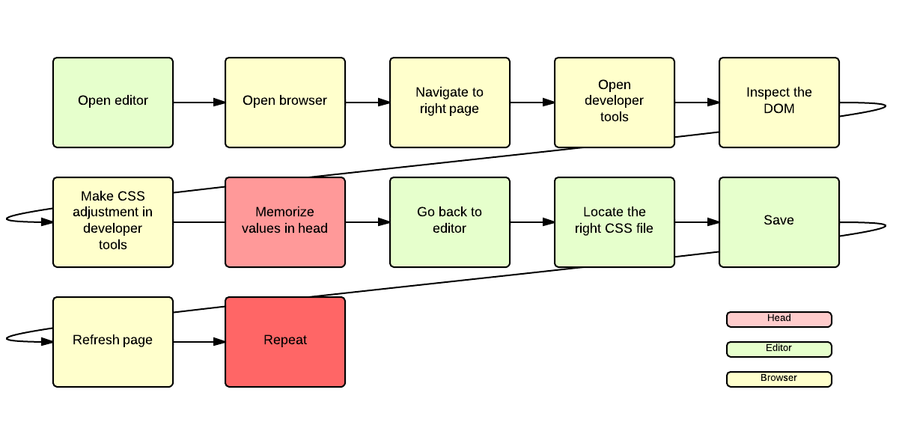

我要成为一个前端设计师
===

> 我年轻的时候，是一个前端工程师。那时候，有这样一个传说：美工是最受妹子的欢迎，其次是半个美工的前端工程师。

本故事纯属瞎掰，如有雷同纯属巧合——Phodal @PasteRight

未满 18 年时，想成为一名 Kernel Hacker，就是那种操着键盘，在屏幕洒下一行行汇编语言的大牛。在我学了一段时间 C++ 后，我觉得：『用记事本写代码，并运行起来』的故事都是骗人的。为了将代码转变为程序，你还需要一个编译工具。

然而有一天，我在网吧里看到一个人在记事本里写代码。开始的时候，我觉得这个人是个新手吧，怎么拿记事本在写代码呢，不是应该都拿 IDE 才能编译运行吗？几分钟过后，我发现他居然能将，记事本写的程序运行起来，太神奇了，Amazing Man。

后来，为了在别人面前装这个 100 分的逼，我成了一名 Web 工程师，而且还是一个前端工程师。

（PS：以上纯属瞎扯）

漂亮的前台
---

各位看官中，有些可能不是前端工程师，那就先让我来说说前端工程师是干什么。前端又可以称之为前台，不是那种每天对你笑、帮你开门、长得还算不错的前台，然而却也差不了多少。

他们要做出好看的、美丽大方的界面，以免吓走那些对颜值有要求的挑剔客户；还要对指引好用户，免得有些用户认错了楼、走错了路口，然后再也不来光顾你们的网站了；有些时候，还要像处女座纠结于对齐，纠结于 px px 的程序员。

你还会看到他们拿起纸当尺子，一点点的测量着什么东西，好似在怀疑这个屏幕是不是真的是 15.4 寸。
如果你看到一个程序员，他在纠结椅子是不是摆放正确的，那么它有可能是三种程序员中的一种：处女座程序员、前端工程师，还有测试工程师。

我们就像上个世纪的网民，时不时地按下 F5 又或者 Command + R 来刷新页面，一直在怀疑页面上的内容是不是最新的。好在后来，有一个伟大的大魔法师发明了一个工具，可以检测到代码修改，自动地帮你刷新页面。终于，不再像个老大爷一样踢电脑，以指望提高图片的质量，甚至去掉马赛克。

过去，我也无法理解：这群智力超群的程序员，为什么会变得如此px px 计较，直到我成为了其中的一员。

我要成为一个前端设计师
---

习惯了大学的生活过后，我和好友楚非就一起去租了一个服务器，从此生活就变得有点艰难。不过有了一个服务器，我们就可以去做个网站，并托管别人的网站，然后就可以坐在学校里数钱了。对于当时的我而言，我并不想成为一个 Web 开发工程师，我还是从心底向往底层的开发。

理想很美好，现实很残酷。虽然我们有了一个服务器，但是它不能立刻地为我们赚钱。我不知道一个完整的网站是怎样的，也没有找到客户。后来，直到大二下学期快结束的时候，我们才算迎来真正的客户。在那段找不到客户，也没有能力找客户的日子里，我们就这样把自己逼上了一条不归路。

> 就这样和很多人一样，为了赚钱，就这样成为了一个前端工程师。

这时，我们就遇到了一个问题：我们俩究竟谁做前端，谁做后台？

这结局大多数人都是知道的，我来负责前端。然而每每说到：他是学美术的，他去做后台；而我是学电子信息工程的，我来负责前端，总会有人感到一些惊讶。选择前端，有这么一个主要的原因：**离成为设计师的目标更进一步**。

我所理解的“设计师”，是广泛意义上的设计师。他们做一些创意的工作，以此来创造一些令人啧啧称赞的作品。这些作品不仅仅可以是一件雕塑，一幅画，还能是一个 Idea，一段代码。

**当你是一个前端工程师的时候，你是一个程序员，还是一个设计师。**

程序员本身也是设计师。虽然程序已经代替了相当数量的手工操作，要想代替程序员则需要更多的时日。然而，程序员手艺的好坏是有相当大的差异的。初学编程的时候，总会看到各种“程序设计”这样高大上的字眼，设计才是程序的核心。这就意味着，写代码的时候，就是在设计作品。设计是一门脑力活，也是一门模式活，从中能看出一个人的风格，从而了解一个人的水平。

因为我认为，前端工程师还应该懂得设计。我便花费了很多时间去：学习素描，熟悉一些原型设计软件，了解各种配色原理。以指望我可以像一个设计师一样，做好前端网页的设计。毕竟代码和大部分艺术作品一样，容易被临摹、复制，而要复制思想则不是一件容易的事。

而到了今天，我的设计能力还是有待商榷。幸运的是，我可以熟练地使用各种可视化工具，然后做出各种美妙的图案。

我还能编写一行行的前端代码，并写下这个系列（《我的职业是前端工程师》）的文章，来帮助大家深入了解前端工程师。
