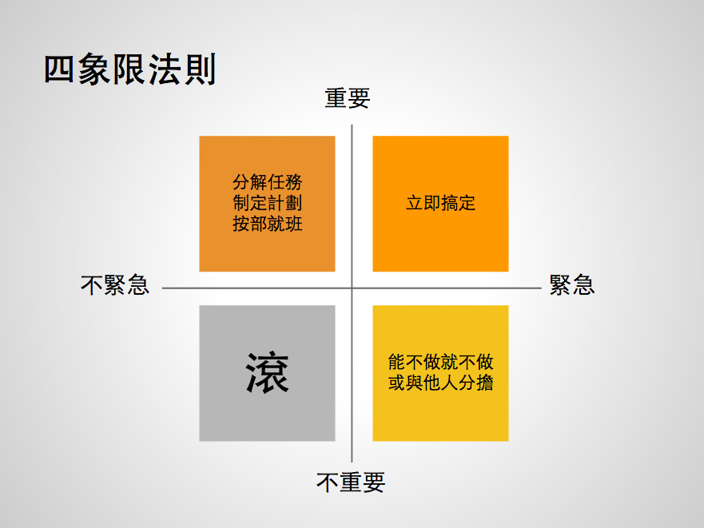

如何选择合适的前端框架
===

> 将 package.json 中的 Ionic 版本改为 2.0.0 的时候，我就思考一个问题。这个该死的问题是——我到底要用哪个框架继续工作下去。

刚开始学习前端的时候，SPA（单页面应用）还没有现在这么流行，可以选择的框架也很少。而今天，我随便打开一个技术相关的网站、应用，只需要简单的看几页，就可以看到丰富的**前端框架世界** Angular 2、React、Vue.js、Ember.js。

当我还是一个新手程序员，我从不考虑技术选型的问题。因为不需要做技术选型、不需要更换架构的时候，便觉得框架丰富就让它丰富吧，**反正我还是用现在的技术栈**。等到真正需要用的时候，依靠之前的基础知识，我仍能很轻松地上手。

可是一旦需要考虑选型的时候，真觉得天仿佛是要塌下来一般。选择 A 框架，则使用过 B 框架的可能会有些不满。选用 B 框架，则使用 A 框架的人会有些不满。选择一个过时的框架，则大部分的人都会不满。这点“小事”，也足够让你几天几夜睡不了一个好觉。

前端的选择恐惧症
---

年轻的程序员都是好奇的猫，玩过一个又一个的前端框架。从毛球上弄出一条条的线，玩啊玩，最后这一个个的框架在脑子里搅浆糊。

### 技术选型：不仅仅受技术影响

有太多的选择，就是一件麻烦的事；没有选择时，就是一件更麻烦的事；有唯一的选择时，事情就会变得超级简单。

倘若，我是那个使用 Java 来开发 API 的少年，我会使用 Spring Boot 来作为开发框架。尽管 Java 是一门臃肿的语言，但保守的选择不会犯上大错。

倘若，我是那个使用 Python 来开发  Web 应用的少年，我会使用 Django 来作为开发框架。它可以让我快速地开发出一个应用。

只可惜，我不再是一个后台开发者，我不再像过去，可以直接、没有顾虑的选择。当我选择 JavaScript 时，我就犯上了「选择恐惧症」。技术选型也是没有银弹的——没有一个框架能解决所有的问题。

在《Growth：全栈 Web 开发思想》一书中，我曾提到过影响技术选型的几个因素。

这时，为了更好的考量不同的因素，你就需要列出重要的象限，如**开发效率**、团队喜好等等。并依此来决定，哪个框架更适合当前的团队和项目。

即使，不考虑前端框架以外的因素，那么技术选型也是相当痛苦的一件事。

### 上线时间影响框架

每一个框架从诞生到受欢迎，都有其特定的原因和背景。不同的开发者选择时，也是依据于其特定情景下的原因和背景。

如 Ruby On Rails诞生之时，带来了极大的开发效率，而开发效率正是当时大部分人的痛点。我们知道 Ruby On Rails 是一个大而广的框架，它可以提供开发者所需要的一切，开发者所需要做的就是实现业务代码。当开发效率不再是问题时，自由度变成了一些开发者的痛点，此时像 Sinatra 这样的微框架就受这些人欢迎。

也因此，开发效率会在很大程度上影响技术选型。毕竟，开发效率在很大程度上决定了上线时间，上线时间很大地影响了技术选型。

 - 用几星期的时间来做一个网站，我首先想到的会是找一个模板。
 - 用几个月的时候来做一个网站，我仍然会想到找一个框架。
 - 用几个年的时间来做一个网站，我会想着是不是可以造几个轮子。

遗憾的是，要遇到可以造轮子的项目不多。

### 锤子定律：你需要更大的视野

**年轻的时候，学会了 A 框架，总觉得 Z 网站用 A 框架来实现会更好**，一定不会像今天这样经常崩溃、出Bug。**时间一长，有时候就会发现，Z 网站使用 A 不合适，他们的问题并不是框架的问题，而是运维的问题。

后来，出于对职业发展的探索，我开始了解咨询师，看到一本名为《咨询的奥秘》的书籍。在这其中，提到一个有意思的定律“锤子定律”（又称为工具定律）——**圣诞节收到一把锤子的孩子，会发现所有东西都需要敲打**。 出现这种情况的主要原因是，**开发者对一个熟悉的工具过度的依赖**。

认真观察，就会发现这个现象随处可见。当一个新手程序员学会了某个最新的框架，通常来说这个框架有着更多的优点，这个时候最容易出现的想法是：**替换现有的框架**。可是，现有的框架并没有什么大的问题。并且凭估不充分时，新的框架则存在更多的风险。

并且，对于某个熟悉工具的过度依赖，特别容易影响到技术决策——看不到更多的可能性。这时候，我们就需要头脑风暴。但是这种情况下，头脑风暴很难帮助解决问题。

在这个时候，拥有更多项目、框架经验的人，可能会做出更好的选择。

前端框架一览
---

在这个复杂的前端框架世界里，我不敢自称是有丰富的选型经验。我只能去分享我用过的那些框架，读者们再结合其他不同的框架来做决定。

### jQuery, 使用生态解决问题

jQuery 创立之初的主要目标是，简化 HTML 与 JavaScript 之间的操作，开发者可以轻松地使用 ``$('elment').doSomething()`` 的形式来对元素进行操作。诞生之后，由于其简单容易手、并且拥有丰富的插件，几度成为最受欢迎的前端框架。大部分动态交互效果，都能轻松地找到 jQuery 插件。即使，没有也能通过其 API，快速地编写相应的插件。

在很多人看来，jQuery 似乎是一个不会在未来用到的框架。可惜到了今天（2017年），我仍然还在项目中使用 jQuery 框架。一年前，我们仍在一个流量巨大的搜索网站上使用用 jQuery。在这几个项目上，仍然使用 jQuery 的原因，大抵有：

 - 项目功能比较简单。并不需要做成一个**单页面应用**，就不需要 MV* 框架
 - 项目是一个**遗留系统**。与其使用其他框架来替换，不如留着以后重写项目

所以，在互联网上仍有大量的网站在使用 jQuery。这些网站多数是 CMS（内容管理系统）、学校网站、政府机构的网站等等。对于这些以内容为主的网站来说，他们并不需要更好的用户体验，只需要能正确的显示内容即可。

因此即使在今天，对于一般的 Web 应用来说，JavaScript 搭配 jQuery 生态下的插件就够用。然而，对于一些为用户提供服务的网站来说，前端就不是那么简单。

### Backbone.js，脊椎连接框架

从 Ajax 出现的那时候开始，前端便迎来了一个新的天地。后来，智能手机开始流行开来。Web 便从桌面端往移动端发展，越来越多的公司开始制作移动应用（APP 和 移动网站）。jQuery Mobile 也诞生这个特殊的时候，然而开发起中大型应用就有些吃力。随后就诞生了 Backbone、Angular 等等的一系列框架。

毕竟，**作为一个程序员，如果我们觉得一个工具不顺手，那么应该造一个新的轮子。**

Backbone.js 是一个轻量级的前端框架，其编程范型大致上匹配MVC架构。它为应用程序提供了模型(models)、集合(collections)、视图(views)的结构。

Backbone 的神奇之处在于，在可以结合不同的框架在一起使用。就像脊椎一样，连接上身体的各个部分。使用 Require.js 来管理依赖；使用 jQuery 来管理 DOM；使用 Mustache 来作为模板。它可以和当时流行的框架，很好地结合到一起。在今天看来，能结合其他前端框架，是一件非常难得的事。

遗憾的是，Backbone.js 有一些的缺陷，使它无法满足复杂的前端应用，如 Model 模型比较简单，要处理好 View 比较复杂。除此，还有更新 DOM 带来的性能问题。

###  Angular，一站式提高生产力

与 Backbone 同一时代诞生的 Angular 便是一个大而全的 MVC 框架。在这个框架里，它提供了我们所需要的各种功能，如模块管理、双向绑定等等。它涵盖了开发中的各个层面，并且层与层之间都经过了精心调适。

我们所需要做的便是遵循其设计思想，来一步步完善我们的应用。Angular.js 的创建理念是：即声明式编程应该用于构建用户界面以及编写软件构件，而命令式编程非常适合来表示业务逻辑。

我开始使用 Angular.js 的原因是，我使用 Ionic 来创建混合应用。出于对制作移动应用的好奇，我创建了一个又一个的移动应用，也在这时学会了 Angular.js。对于我而言，选择合适的技术栈，远远比选择流行的技术栈要重要得多，这也是我喜欢使用 Ionic 的原因。当我们在制作一个应用，它对性能要求不是很高的时候，那么我们应该选择开发速度更快的技术栈。

对于复杂的前端应用来说，基于 Angular.js 应用的运行效率，仍然有大量地改进空间。在应用运行的过程中，需要不断地操作 DOM，会造成明显的卡顿。对于 WebView 性能较差或早期的移动设备来说，这就是一个致命伤。

幸运的是在 2016 年底，Angular 团队推出了 Angular 2，它使用 Zone.js 实现变化的自动检测、

而迟来的 Angular 2 则受**奥斯本效应**[^osborne]的影响，逼得相当多的开发者们开始转向其它的框架。

[^osborne]: 颇受欢迎的个人电脑厂商奥斯本，其公司的创新式便携电脑还没有上市，就宣布他们要推出的更高档的机器，而又迟迟无法交货，消费者闻风纷纷停止下单订购现有机种，最后导致奥斯本因收入枯竭而宣布破产。

### React，组件化提高复用

从 Backbone 和 Angular.js 的性能问题上来看，我们会发现 DOM 是单页面应用急需改善的问题——主要是DOM 的操作非常慢。而在单页面应用中，我们又需要处理大量的 DOM，性能就更是问题了。于是，采用 Virtual DOM 的 React 的诞生，让那些饱受性能苦恼的开发者欢迎。

传统的 DOM 操作是直接在 DOM 上操作的，当需要修改一系列元素中的值时，就会直接对 DOM 进行操作。而采用 Virtual DOM 则会对需要修改的 DOM 进行比较（DIFF），从而只选择需要修改的部分。也因此对于不需要大量修改 DOM 的应用来说，采用 Virtual DOM 并不会有优势。开发者就可以创建出可交互的 UI。

除了编写应用时，不需要对 DOM 进行直接操作，提高了应用的性能。React 还有一个重要思想是组件化，即 UI 中的每个组件都是独立封装的。与此同时，由于这些组件独立于 HTML，使它们不仅仅可以运行在浏览器里，还能作为原生应用的组件来运行。

同时，在 React 中还引入了 JSX 模板，即在 JS 中编写模板，还需要使用 ES 6。令人遗憾的是 React 只是一个 View 层，它是为了优化 DOM 的操作而诞生的。为了完成一个完整的应用，我们还需要路由库、执行单向流库、web API 调用库、测试库、依赖管理库等等，这简直是一场噩梦。因此为了完整搭建出一个完整的 React 项目，我们还需要做大量的额外工作。

大量的人选择 React 还有一个原因是：React Native、React VR 等等，可以让 React 运行在不同的平台之上。我们还能通过 React 轻松编写出原生应用，还有 VR 应用。

在看到 Angular 2 升级以及 React 复杂性的时候，我相信有相当多的开发者转而选择 Vue.js。

### Vue.js，简单也是提高效率

引自官网的介绍，Vue.js 是一套构建用户界面的渐进式框架，专注于MVVM 模型的 ViewModel 层。Vue.js 不仅简单、容易上手、配置设施齐全，同时拥有中文文档。

对于使用 Vue.js 的开发者来说，我们仍然可以使用 熟悉的 HTML 和 CSS 来编写代码。并且，Vue.js 也使用了 Virtual DOM、Reactive 及组件化的思想，可以让我们集中精力于编写应用，而不是应用的性能。

对于没有 Angular 和 React 经验的团队，并且规模不大的前端项目来说，Vue.js 是一个非常好的选择。

虽然 Vue.js 的生态与 React 相比虽然差上一截，但是配套设施还是相当齐全的，如 Vuex 、 VueRouter。只是，这些组件配套都由官方来提供、维护，甚至连 awesome-vue 也都是官方项目，总觉得有些奇怪。

除此，Vue.js 中定义了相当多的规矩，这种风格似乎由 jQuery 时代遗留下来的。照着这些规矩来写代码，让人觉得有些不自在。

和 React 相似的是，Vue.js 也有相应的 Native 方案 Weex，仍然值得我们期待。

### 小结

除了上面提到的这些前端框架，我还用过 Reactive、Ember.js、Mithril.js，遗憾的是同 Vue.js 一样，我没有在大一点的、正式项目上用过。也因此，我没有能力、经验、精力去做更详细的介绍。有兴趣的读者，可以做更详细的了解，也可以在 GitHub ([https://github.com/phodal/fe](https://github.com/phodal/fe)) 上给我们提交一个 Pull Request。

总结
---

今天，大部分的框架并不只是那么简单。为了使用这个框架你，可能需要学习更多的框架、知识、理论。一个很好的例子就是 React，这个框架的开发人员，引入了相当多的概念，JSX、Virtual Dom。而为了更好地使用 React 来开发，我们还需要引入其他框架，如 Redux、ES6 等等的内容。

这些框架从思想上存在一些差异，但是它们都有相似之处，如组件化、MV**、All in JS、模板引擎等等。欲知后事如何，请期待下一章“前端=模板 + 数据，这就是模板引擎”。
