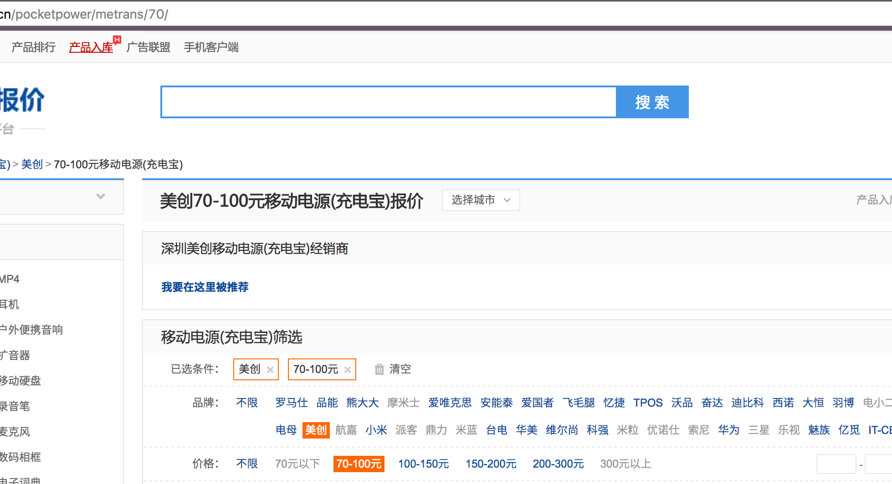
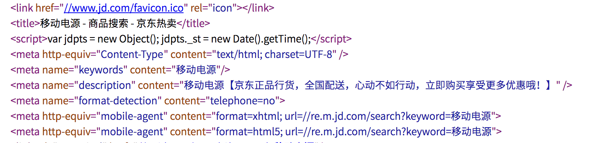
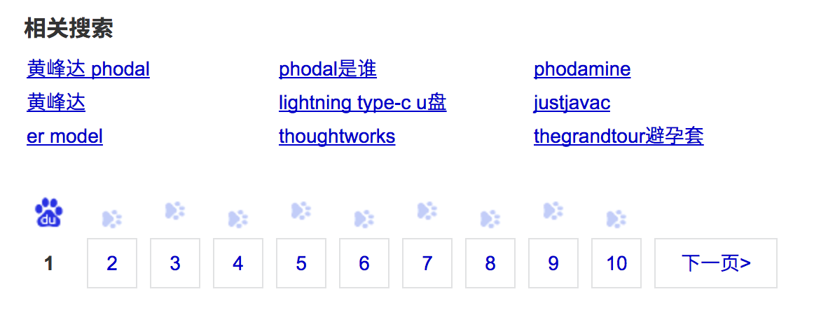

前端程序员必知：四个基本但重要的搜索引擎优化技巧
===

自打我开始写博客起（大概是在 2011 年左右），便开始研究搜索引擎优化（Search Engine Optimization），这项看似不重要的技术为我的博客带来 了大量的流量。工作之后，我才发现是一门大生意——为了排在搜索引擎靠前的位置，每个网站每天都在不断的送钱给Google、百度 等搜索引擎公司。当我们在 Google、百度上点击一下，首页上的某个推广链接，可能就会为它们带去几十美刀的收入。

要是能竞争到此，那说明这个行业相当的赚钱。同时，处在这个行业的人呐也越来越不赚钱了——他们都把钱交给了科技公司了。

内部 SEO

如何设计一个高质量的 URL
---

如我的博客的正常 URL 是这样的，https://www.phodal.com/blog/use-jenkinsfile-blue-ocean-visualization-pipeline/，对应的标题是：Jenkins 2.0 里使用 Jenkinsfile 设计更好的 Pipeline

如我的专栏：https://read.douban.com/column/5945187/ 《我的职业是前端工程师》 这真是一个不好记的东西

知乎上 https://zhuanlan.zhihu.com/beafe

这里的 use-jenkinsfile-blue-ocean-visualization-pipeline 就是优化的部分，而为了设计方便，大部分的单页面应用都会做成 /blog/123

这样做并没有啥问题，但是当用户搜索 jenkinsfile 和 pipline 时，劣势就出现了。

而当搜索条件更加复杂时，想搜索一个 100~150 元左右的 移动电源时，不应该是 product/12345678 ，product/mobilebank-range-100-150-city-shenzhen

如果有后台渲染时，数据直接由后台处理：

在前端处理逻辑就会比较复杂，需要用正则去：(\S+)-range-(\d+)-(\d+)-city-(\S+)

高质量的标题：
---

不算太差的标题

 - 我的职业是前端工程师 - 知乎专栏

移动电源 -【美创70-100元移动电源(充电宝)】美创70-100元移动电源(充电宝)报价及图片大全-ZOL中关村在线

【Phodal牌 100-150 元移动电源】Phodal 100- 150 元移动电源 - SITE INFO

Description 和 Keywords
---

Keywords 比较常见的作法就是重复杂 100-150 元移动电源之类的，再按用户的搜索习惯

Description 就比较复杂了，如 

> 太平洋电脑网提供100元及以下移动电源大全全面服务信息，包含100元及以下移动电源报价、参数、评测、比较、点评、论坛等，帮您全面了解100元及以下移动电源。

像京东这种的就弱爆了：

在 HTML 中返回内容
---

如知乎，可能是出自于反爬虫原因。又或者是缺少好的 React 后台渲染机制，返回的是 JSON，数据..

单页面应用的后台渲染

