最流行的编程语言JavaScript能做什么？
===

首先很遗憾的一点是，“PHP虽然是最好的语言”，但是它不是最流行的语言。

对不起的还有刚刚在4月TIOBE编程语言排行榜上榜的各个语言：

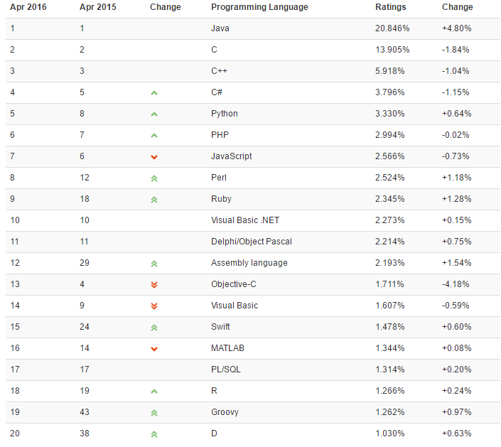

你们都很棒，但是你们都担当不了这个大任。

开始之前，我先说一下我常用的三个语言：Java、JavaScript、Python。

 - Java，让我学到了很多架构层级的知识，这一点可以参考我之前写的架构相关文档。虽然我一点儿也不喜欢这个语言，但是它真的很棒。
 - Python，它真的足够简单，以至于我喜欢拿它学习各种理论知识，如推荐系统、贝叶斯定理、自然语言处理等等。
 - JavaScript，看下文。

数据可视化
---

在过去我阅读的一些书籍里面，主要是以Processing作为可视化的语言——它起始于2001年，它最初是面向美术工作者和设计者创建的，后来变成了全面的设计和原型工具，可以用于创建复杂数据可视化领域。

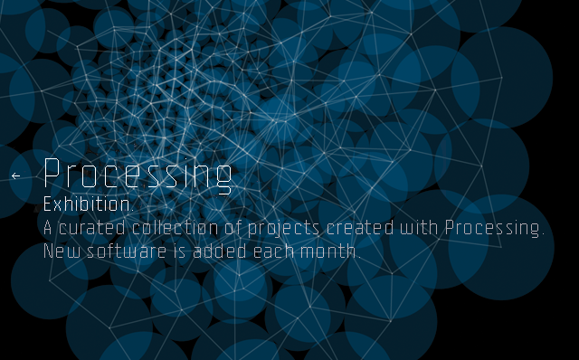

Processing被带入了到Web领域产生了Processing.js，还出现了D3.js。

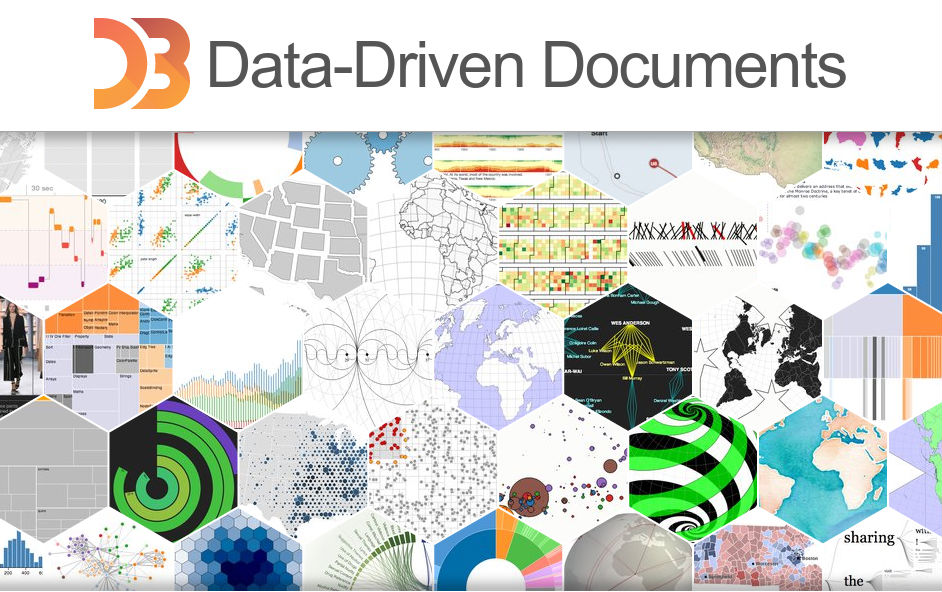

当然还有Plotly、Leaflet、Sigma JS等等的工具。

移动端应用： Cordova
---

接着就是PhoneGap（今天的Cordova），将WebView带向了移动应用，也将JavaScript带向了移动应用。

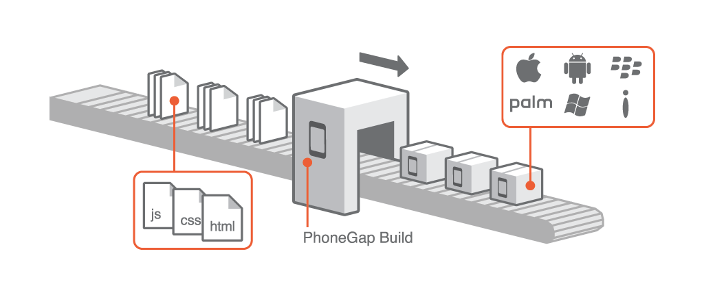

使用Cordova，可以让我们**一次开发多平台发布**。我们也顺便提一下Ionic，作为混合应用的翘楚：

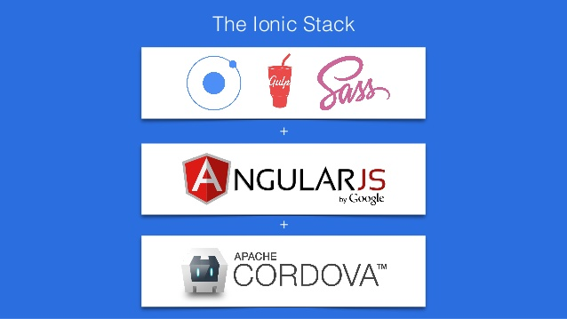

移动端应用： React Native
---

既然我们已经提到了Cordova，那么我们也应该说说**React Native**。也是一次开发多次运行：

虽然它的坑还有很多，但是还是值得期待的。

服务端：Node.js
---

正是V8的性能将JavaScript带到了一个新的高度，于是Node.js诞生了——前端、后台都可以用JavaScript，一个JavaScript的全栈时代。

Mongodb作为数据库，Express作为Server端MVC，他们可以提供一个RESTful服务，那么再加上MVVM框架的Angular.js，你就知道我在说什么!

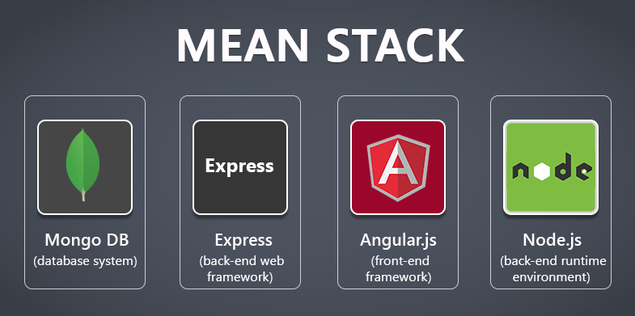

桌面应用： NW.js 和 Electron
---

NW.js 是基于 Chromium 和 Node.js 运行的， 它们可以让我们用HTML和JavaScript来制作桌面应用。除了NW.js还有最近比较火的Electron，Atom编辑器的

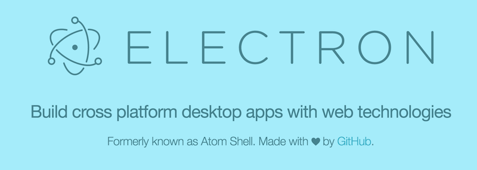

与Cordova的多平台构建多版本不同的是，Electron可以在一个平台上构建多个平台的应用。即我们可以在Mac OS上打包出Linux和Windows上的应用，而不需要在Windows再编译一次。

带向了桌面端，让桌面和Web保持了一致。最成功的案例就是估值达30亿美元的Slack：

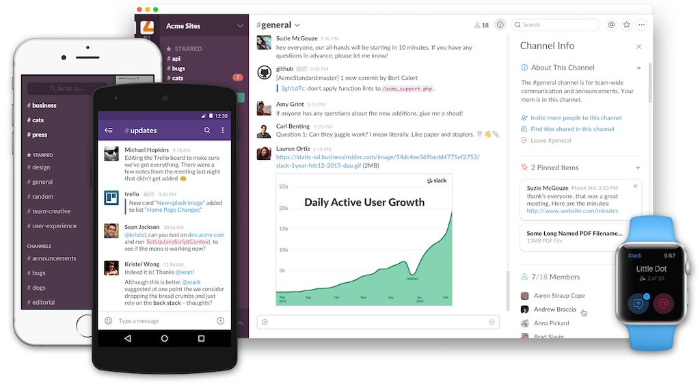

So，如果你使用桌面端的Slack就会很卡~~。

全平台应用
---

还记得我写的那篇《[一份代码构建移动、桌面、Web全平台应用](https://www.phodal.com/blog/build-full-platform-application/)》，在Eletcron上运行Ionic，就意味着无限的可能性。

能用Web开发的事情就用Web来完成就好了。

游戏
---

自从WebGL被带入浏览器的那一刻，就决定了这又是一个新的天地。

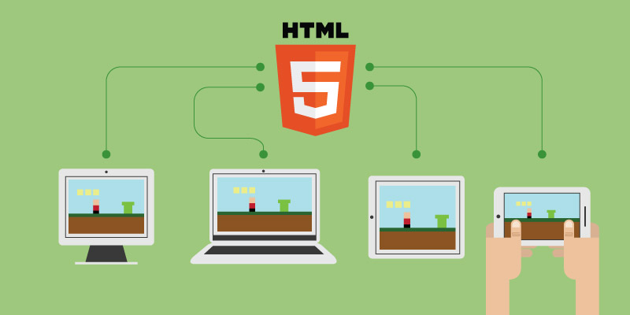

让我们忘记编译、启动更新、外挂等等的问题，并且我们还可以一次开发直接运行。

VR
---

如果你看到过之前的那篇《[JavaScript在VR世界的应用](https://www.phodal.com/blog/why-javascript-will-use-vr-world/)》，那么你就会对这个内容有更多的印象。

主要思想还是通过WebView来渲染VR视角：

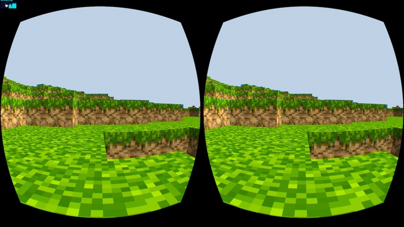

并且各浏览器产商各在推进WebVR 为虚拟现实设备显示提供支持。

AR
---

虽然大部分的AR应用可能离我们有点远，但是离我们最近的就是Leap Motion——它可以利用手掌和手指动作来进行输入，但无需手部接触或者触摸。

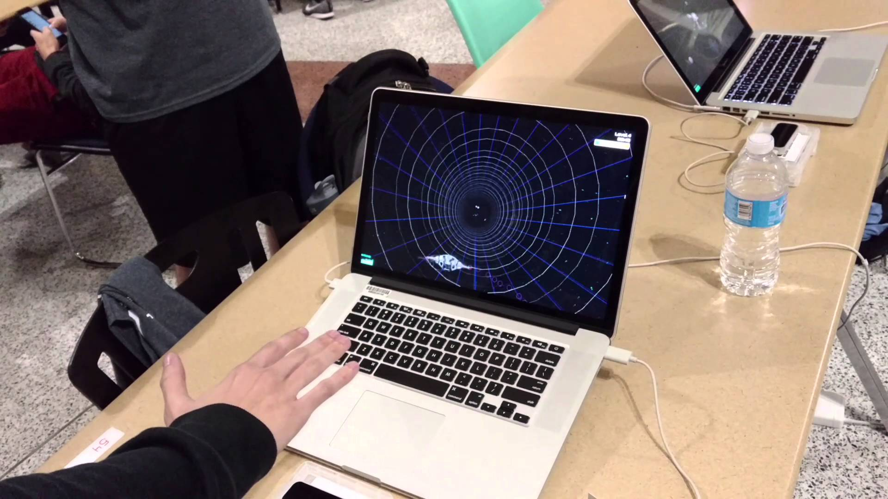

同理于VR，读取传感器的数据，再将其手势交由浏览器端来处理。详细可以参考我之前写的：《[Leap Motion JavaScript开发 手势控制基础篇](https://www.phodal.com/blog/leap-motion-gestures-example/)》

硬件
---

早先我看到了Arduino在编译的时候，以DSL的方式封装了API。而NodeMCU则内建了Lua语言的支持，可以让开始者使用Lua来开始。 而Tessel 原生就提供了JavaScript运行环境，我们写需要写好JavaScript就可以在上面运行。

Tessel 2属于配置比较高的硬件，而低配的呢？

三星设计了JerryScript引擎，它能够运行在小于64KB内存上，且全部代码能够存储在不足200KB的只读存储（ROM）上。

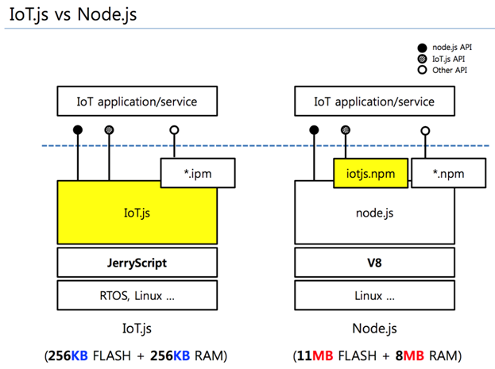

想想就觉得未来是美好的。

物联网
---

等等，上面三星推出的是IoT.js，这就意味着它已经可以在物联网领域中应用了，为什么还会有这里的应用呢？我只是想稍微提一下这个：

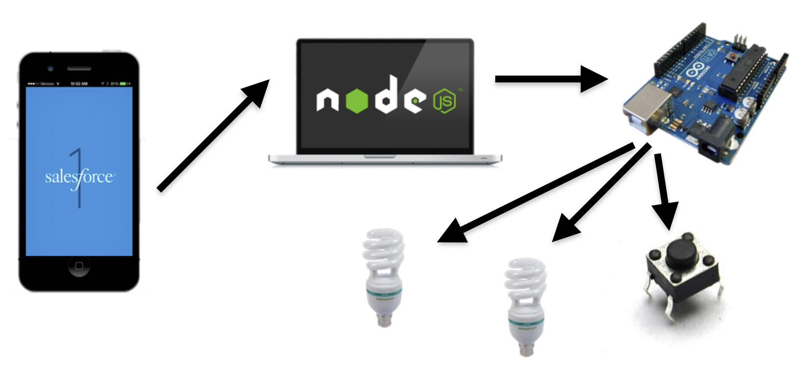

上面说到的只是Node.js在Web中的应用，而物联网和Web的很大不同之处在于，物联网可以使用各种不同的协议，而这些协议都需要Node.js对其的支持。

因此，如果我们需要开始Web版、移动应用，那么我们自然更需要其作为后台。

操作系统界面
---

虽然更好的机器带来了更好的性能，但是显然人们对于原生应用的需求并没有那么强烈。Firefox OS已经在移动操作系统败下阵来，但是这个操作被带到了物联网领域：

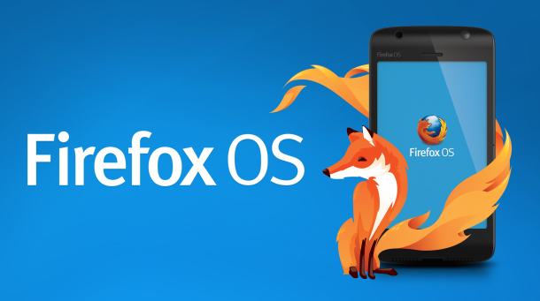

这就意味着，我们可以使用JavaScript来开发操作系统的界面了。

你觉得JavaScript还能做什么？

